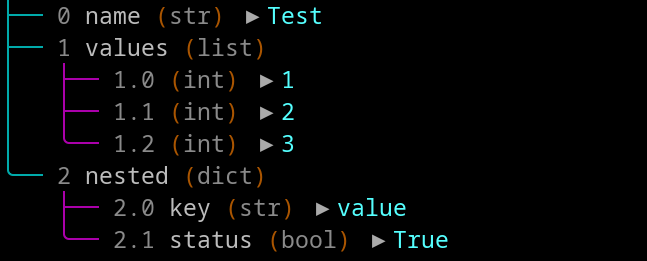

# Python Data Tree Visualizer


[](LICENSE)

A powerful ANSI-colored tree visualization tool for nested Python data structures.



## Features

- 🎨 **Color-coded output** for easy differentiation of data types
- 🌳 **Hierarchical display** of complex nested structures
- 🔍 **Type information** shown for all elements
- 📊 **Index numbering** for easy navigation
- 🏷️ **Custom formatting** for special Python objects
- 🚀 **Supports** all standard Python types plus custom classes

## Installation

- ### [Download](https://raw.githubusercontent.com/OkhtayMp/python-data-tree/refs/heads/main/datatree.py)

- ```bash 
  curl -O https://github.com/OkhtayMp/python-data-tree/raw/refs/heads/main/datatree.py
  ```

## Usage

```python
from datatree import print_tree

data = {
    "name": "Test",
    "values": [1, 2, 3],
    "nested": {
        "key": "value",
        "status": True
    }
}

print_tree(data)
```
## Example Output
This output is color-coded like the image: [Image](images/example.png)


```
├── 0 name (str) ▶ Test
├── 1 values (list)
│   ├── 1.0 (int) ▶ 1
│   ├── 1.1 (int) ▶ 2
│   ╰── 1.2 (int) ▶ 3
╰── 2 nested (dict)
    ├── 2.0 key (str) ▶ value
    ╰── 2.1 status (bool) ▶ True
```

###  click -> [Advanced example](example.md)


## Type Support Matrix 🔢

| Category       | Supported Types                  | Special Features              |
|----------------|----------------------------------|-------------------------------|
| **Primitives** | `int`, `float`, `str`, `bool`    | Value highlighting            |
| **Containers** | `list`, `dict`, `set`, `tuple`   | Size indicators               |
| **Callables**  | Functions, methods, lambdas      | Qualified name display        |
| **Objects**    | Classes, instances               | Attribute summary             |
| **Special**    | `bytes`, `range`, exceptions     | Custom representations       |


## Requirements

- Python 3.10+
- Terminal with ANSI color support

## Contributing 🤝

Pull requests are welcome! For major changes, please open an issue first to discuss what you'd like to change.


## License 📜

This project is licensed under the [MIT License](LICENSE) - see the [LICENSE](LICENSE) file for details.


